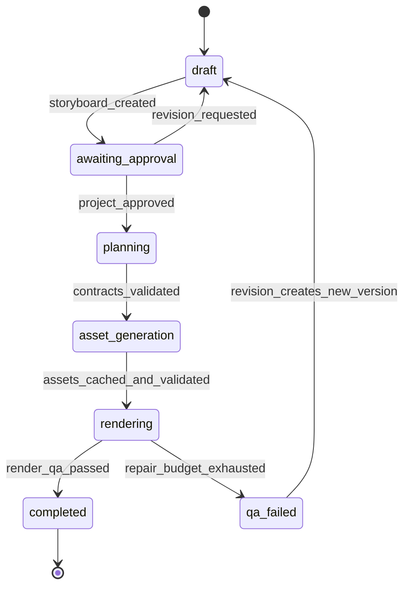
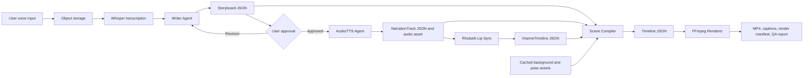

# System Architecture

## 1. Architectural Principles & System Design

### Phase 2 Local-First Planning Modification

Phase 2 uses Groq's supported `openai/gpt-oss-20b` endpoint for structural text planning. It replaced the originally planned Llama endpoint after that endpoint was deprecated for the active account tier.

- Whisper voice-to-text, all assets, artifact storage, review media, and FFmpeg rendering remain local on macOS.
- The planner sends only plain-language instruction text and approved catalog descriptions to Groq.
- Groq returns JSON parameter blueprints only. Local Pydantic and semantic validation must accept them before any local asset, layout, preview, or renderer tool runs.
- No audio, images, video, artifact IDs, local file paths, FFmpeg commands, or API keys are included in Groq planner requests.

Phase 1 produces short English 2D cartoon videos from a user's spoken instruction. It is intentionally constrained to 15-45 second videos, up to three scenes, two pre-approved characters, fixed transparent pose assets, mouth-sprite swaps, cached backgrounds, and an MP4 output.

### Deterministic execution

- AI agents may propose creative content, but they must output validated JSON contracts.
- The scene compiler and renderer consume only validated, immutable contracts and cached assets.
- Each render is reproducible from the project version, artifact digests, renderer version, frame rate, and asset versions.
- All frame calculations use integer frame indexes. An interval from `start_frame` through `end_frame` is inclusive.

### Event-driven orchestration

- The workflow is a durable state machine. Temporal activities must be idempotent and use a stable idempotency key.
- Long-running GPU, storage, TTS, lip-sync, and rendering work runs outside the orchestrator process.
- Workers publish artifacts and state events; they do not directly mutate a previous project version.

### Contract-first design

- Pydantic v2 models are the Python runtime source for validation and export Draft 2020-12 JSON Schema.
- JSON Schema validates a document's shape. A SemanticValidator validates cross-document relationships and arithmetic rules.
- Every generated artifact has a stable ID, project ID, project version, content digest, producer version, and immutable storage location.

### Asset and agent boundaries

- The Writer Agent creates narration text and a Storyboard. It does not create audio.
- The Audio/TTS Agent creates a NarrationTrack and its audio asset from approved narration text.
- Rhubarb creates a VisemeTimeline from the approved narration audio and its matching transcript.
- Background images are generated or selected during asset generation, cached, and referenced by immutable asset IDs. Render workers never call an image-generation service.
- The Scene Compiler is the only service that creates Timeline documents. The renderer never interprets free-form agent text.

## 2. Complete Draft 2020-12 JSON Schemas

The schemas below are standalone Draft 2020-12 schemas. Runtime validation additionally applies the semantic invariants listed after the schemas.

### ProjectSpec.schema.json

```json
{
  "$schema": "https://json-schema.org/draft/2020-12/schema",
  "$id": "https://agenticai2d.local/schemas/ProjectSpec.schema.json",
  "title": "ProjectSpec",
  "type": "object",
  "additionalProperties": false,
  "required": ["project_id", "version", "status", "created_at", "input", "output", "creative_constraints"],
  "properties": {
    "project_id": {"type": "string", "pattern": "^proj_[a-zA-Z0-9_-]{8,64}$"},
    "version": {"type": "integer", "minimum": 1},
    "parent_version": {"type": ["integer", "null"], "minimum": 1},
    "status": {"type": "string", "enum": ["draft", "awaiting_approval", "planning", "asset_generation", "rendering", "completed", "qa_failed"]},
    "created_at": {"type": "string", "format": "date-time"},
    "input": {
      "type": "object",
      "additionalProperties": false,
      "required": ["audio_asset_id", "user_prompt", "language"],
      "properties": {
        "audio_asset_id": {"type": "string", "pattern": "^asset_[a-zA-Z0-9_-]{8,128}$"},
        "user_prompt": {"type": "string", "minLength": 1, "maxLength": 10000},
        "language": {"type": "string", "const": "en"}
      }
    },
    "output": {
      "type": "object",
      "additionalProperties": false,
      "required": ["aspect_ratio", "width", "height", "fps", "format"],
      "properties": {
        "aspect_ratio": {"type": "string", "enum": ["16:9", "9:16", "1:1"]},
        "width": {"type": "integer", "enum": [1280, 1920]},
        "height": {"type": "integer", "enum": [720, 1080, 1920]},
        "fps": {"type": "integer", "enum": [24, 30]},
        "format": {"type": "string", "const": "mp4"}
      }
    },
    "creative_constraints": {
      "type": "object",
      "additionalProperties": false,
      "required": ["target_duration_seconds", "style_preset", "character_ids", "narration_source", "captions_enabled", "user_approval_required"],
      "properties": {
        "target_duration_seconds": {"type": "integer", "minimum": 15, "maximum": 45},
        "style_preset": {"type": "string", "const": "storybook_2d_flat"},
        "character_ids": {
          "type": "array",
          "minItems": 1,
          "maxItems": 2,
          "uniqueItems": true,
          "items": {"type": "string", "pattern": "^char_[a-zA-Z0-9_-]{3,128}_v[1-9][0-9]*$"}
        },
        "narration_source": {"type": "string", "enum": ["user_recording", "synthetic_tts"]},
        "captions_enabled": {"type": "boolean"},
        "user_approval_required": {"type": "boolean", "const": true}
      }
    }
  }
}
```

### Storyboard.schema.json

```json
{
  "$schema": "https://json-schema.org/draft/2020-12/schema",
  "$id": "https://agenticai2d.local/schemas/Storyboard.schema.json",
  "title": "Storyboard",
  "type": "object",
  "additionalProperties": false,
  "required": ["storyboard_id", "project_id", "project_version", "fps", "duration_frames", "scenes"],
  "properties": {
    "storyboard_id": {"type": "string", "pattern": "^story_[a-zA-Z0-9_-]{8,128}$"},
    "project_id": {"type": "string", "pattern": "^proj_[a-zA-Z0-9_-]{8,64}$"},
    "project_version": {"type": "integer", "minimum": 1},
    "fps": {"type": "integer", "enum": [24, 30]},
    "duration_frames": {"type": "integer", "minimum": 1, "maximum": 1350},
    "scenes": {"type": "array", "minItems": 1, "maxItems": 3, "items": {"$ref": "#/$defs/scene"}}
  },
  "$defs": {
    "scene": {
      "type": "object",
      "additionalProperties": false,
      "required": ["scene_id", "sequence", "start_frame", "duration_frames", "background_asset_id", "narration", "camera_cues", "actor_cues"],
      "properties": {
        "scene_id": {"type": "string", "pattern": "^scene_[a-zA-Z0-9_-]{8,128}$"},
        "sequence": {"type": "integer", "minimum": 1},
        "start_frame": {"type": "integer", "minimum": 0},
        "duration_frames": {"type": "integer", "minimum": 1},
        "background_asset_id": {"type": "string", "pattern": "^asset_[a-zA-Z0-9_-]{8,128}$"},
        "narration": {
          "type": "object",
          "additionalProperties": false,
          "required": ["utterance_id", "text"],
          "properties": {
            "utterance_id": {"type": "string", "pattern": "^utt_[a-zA-Z0-9_-]{8,128}$"},
            "text": {"type": "string", "minLength": 1, "maxLength": 1000}
          }
        },
        "camera_cues": {
          "type": "array",
          "minItems": 1,
          "items": {
            "type": "object",
            "additionalProperties": false,
            "required": ["frame_offset", "preset"],
            "properties": {
              "frame_offset": {"type": "integer", "minimum": 0},
              "preset": {"type": "string", "enum": ["wide", "medium", "close_up", "pan_left", "pan_right", "static"]}
            }
          }
        },
        "actor_cues": {
          "type": "array",
          "minItems": 1,
          "maxItems": 2,
          "items": {
            "type": "object",
            "additionalProperties": false,
            "required": ["character_id", "pose_asset_id", "start_frame_offset", "duration_frames", "position"],
            "properties": {
              "character_id": {"type": "string", "pattern": "^char_[a-zA-Z0-9_-]{3,128}_v[1-9][0-9]*$"},
              "pose_asset_id": {"type": "string", "pattern": "^asset_[a-zA-Z0-9_-]{8,128}$"},
              "start_frame_offset": {"type": "integer", "minimum": 0},
              "duration_frames": {"type": "integer", "minimum": 1},
              "position": {"type": "string", "enum": ["left", "center", "right"]}
            }
          }
        }
      }
    }
  }
}
```

### NarrationTrack.schema.json

```json
{
  "$schema": "https://json-schema.org/draft/2020-12/schema",
  "$id": "https://agenticai2d.local/schemas/NarrationTrack.schema.json",
  "title": "NarrationTrack",
  "type": "object",
  "additionalProperties": false,
  "required": ["narration_track_id", "project_id", "project_version", "audio_asset_id", "source", "language", "sample_rate_hz", "fps", "duration_frames", "utterances"],
  "properties": {
    "narration_track_id": {"type": "string", "pattern": "^narr_[a-zA-Z0-9_-]{8,128}$"},
    "project_id": {"type": "string", "pattern": "^proj_[a-zA-Z0-9_-]{8,64}$"},
    "project_version": {"type": "integer", "minimum": 1},
    "audio_asset_id": {"type": "string", "pattern": "^asset_[a-zA-Z0-9_-]{8,128}$"},
    "source": {"type": "string", "enum": ["user_recording", "synthetic_tts"]},
    "language": {"type": "string", "const": "en"},
    "sample_rate_hz": {"type": "integer", "enum": [44100, 48000]},
    "fps": {"type": "integer", "enum": [24, 30]},
    "duration_frames": {"type": "integer", "minimum": 1},
    "utterances": {
      "type": "array",
      "minItems": 1,
      "items": {
        "type": "object",
        "additionalProperties": false,
        "required": ["utterance_id", "text", "start_frame", "end_frame", "words"],
        "properties": {
          "utterance_id": {"type": "string", "pattern": "^utt_[a-zA-Z0-9_-]{8,128}$"},
          "text": {"type": "string", "minLength": 1},
          "start_frame": {"type": "integer", "minimum": 0},
          "end_frame": {"type": "integer", "minimum": 0},
          "words": {
            "type": "array",
            "minItems": 1,
            "items": {
              "type": "object",
              "additionalProperties": false,
              "required": ["text", "start_frame", "end_frame"],
              "properties": {
                "text": {"type": "string", "minLength": 1},
                "start_frame": {"type": "integer", "minimum": 0},
                "end_frame": {"type": "integer", "minimum": 0}
              }
            }
          }
        }
      }
    }
  }
}
```

### VisemeTimeline.schema.json

```json
{
  "$schema": "https://json-schema.org/draft/2020-12/schema",
  "$id": "https://agenticai2d.local/schemas/VisemeTimeline.schema.json",
  "title": "VisemeTimeline",
  "type": "object",
  "additionalProperties": false,
  "required": ["viseme_timeline_id", "project_id", "project_version", "narration_track_id", "input_audio_asset_id", "generator", "fps", "duration_frames", "character_id", "mouth_set_id", "cues"],
  "properties": {
    "viseme_timeline_id": {"type": "string", "pattern": "^viseme_[a-zA-Z0-9_-]{8,128}$"},
    "project_id": {"type": "string", "pattern": "^proj_[a-zA-Z0-9_-]{8,64}$"},
    "project_version": {"type": "integer", "minimum": 1},
    "narration_track_id": {"type": "string", "pattern": "^narr_[a-zA-Z0-9_-]{8,128}$"},
    "input_audio_asset_id": {"type": "string", "pattern": "^asset_[a-zA-Z0-9_-]{8,128}$"},
    "generator": {"type": "string", "const": "rhubarb"},
    "fps": {"type": "integer", "enum": [24, 30]},
    "duration_frames": {"type": "integer", "minimum": 1},
    "character_id": {"type": "string", "pattern": "^char_[a-zA-Z0-9_-]{3,128}_v[1-9][0-9]*$"},
    "mouth_set_id": {"type": "string", "pattern": "^mouthset_[a-zA-Z0-9_-]{3,128}_v[1-9][0-9]*$"},
    "cues": {
      "type": "array",
      "minItems": 1,
      "items": {
        "type": "object",
        "additionalProperties": false,
        "required": ["start_frame", "end_frame", "mouth_shape"],
        "properties": {
          "start_frame": {"type": "integer", "minimum": 0},
          "end_frame": {"type": "integer", "minimum": 0},
          "mouth_shape": {"type": "string", "enum": ["A", "B", "C", "D", "E", "F", "G", "H", "X"]}
        }
      }
    }
  }
}
```

### Timeline.schema.json

```json
{
  "$schema": "https://json-schema.org/draft/2020-12/schema",
  "$id": "https://agenticai2d.local/schemas/Timeline.schema.json",
  "title": "Timeline",
  "type": "object",
  "additionalProperties": false,
  "required": ["timeline_id", "project_id", "project_version", "fps", "width", "height", "duration_frames", "visual_tracks", "audio_tracks"],
  "properties": {
    "timeline_id": {"type": "string", "pattern": "^timeline_[a-zA-Z0-9_-]{8,128}$"},
    "project_id": {"type": "string", "pattern": "^proj_[a-zA-Z0-9_-]{8,64}$"},
    "project_version": {"type": "integer", "minimum": 1},
    "fps": {"type": "integer", "enum": [24, 30]},
    "width": {"type": "integer", "enum": [1280, 1920]},
    "height": {"type": "integer", "enum": [720, 1080, 1920]},
    "duration_frames": {"type": "integer", "minimum": 1, "maximum": 1350},
    "visual_tracks": {"type": "array", "minItems": 1, "items": {"$ref": "#/$defs/visualTrack"}},
    "audio_tracks": {"type": "array", "minItems": 1, "maxItems": 1, "items": {"$ref": "#/$defs/audioTrack"}}
  },
  "$defs": {
    "visualTrack": {
      "type": "object",
      "additionalProperties": false,
      "required": ["track_id", "kind", "z_index", "clips"],
      "properties": {
        "track_id": {"type": "string", "pattern": "^vtrack_[a-zA-Z0-9_-]{8,128}$"},
        "kind": {"type": "string", "enum": ["background", "character_pose", "character_mouth", "caption"]},
        "z_index": {"type": "integer", "minimum": 0, "maximum": 100},
        "clips": {
          "type": "array",
          "minItems": 1,
          "items": {
            "type": "object",
            "additionalProperties": false,
            "required": ["clip_id", "asset_id", "start_frame", "duration_frames"],
            "properties": {
              "clip_id": {"type": "string", "pattern": "^clip_[a-zA-Z0-9_-]{8,128}$"},
              "asset_id": {"type": "string", "pattern": "^asset_[a-zA-Z0-9_-]{8,128}$"},
              "start_frame": {"type": "integer", "minimum": 0},
              "duration_frames": {"type": "integer", "minimum": 1},
              "x_percent": {"type": "number", "minimum": 0, "maximum": 100},
              "y_percent": {"type": "number", "minimum": 0, "maximum": 100},
              "scale": {"type": "number", "minimum": 0.1, "maximum": 3},
              "viseme_timeline_id": {"type": "string", "pattern": "^viseme_[a-zA-Z0-9_-]{8,128}$"}
            }
          }
        }
      }
    },
    "audioTrack": {
      "type": "object",
      "additionalProperties": false,
      "required": ["track_id", "kind", "asset_id", "start_frame", "duration_frames"],
      "properties": {
        "track_id": {"type": "string", "pattern": "^atrack_[a-zA-Z0-9_-]{8,128}$"},
        "kind": {"type": "string", "const": "narration"},
        "asset_id": {"type": "string", "pattern": "^asset_[a-zA-Z0-9_-]{8,128}$"},
        "start_frame": {"type": "integer", "const": 0},
        "duration_frames": {"type": "integer", "minimum": 1}
      }
    }
  }
}
```

### Semantic invariants

- All documents in a production set have the same `project_id`, `project_version`, and `fps`.
- `duration_frames` equals `target_duration_seconds * fps` for ProjectSpec-derived output.
- Storyboard scenes have unique IDs and sequences, are ordered, do not overlap, and exactly cover the storyboard duration.
- A scene's camera and actor cue ranges must remain within that scene's duration.
- Each Storyboard narration `utterance_id` appears exactly once in NarrationTrack, with identical text.
- Narration utterances and words are ordered, non-overlapping, and remain within NarrationTrack duration.
- Viseme cues are ordered, non-overlapping, and remain within the matching NarrationTrack duration.
- Timeline clips remain within Timeline duration. Every referenced asset and viseme ID must exist and have matching project version.
- A `character_mouth` track references a VisemeTimeline for the matching character and mouth set.

## 3. State Machine Diagrams & Event Sourcing Rules

### Workflow state machine



### Event sourcing rules

- Store append-only events with `event_id`, `project_id`, `project_version`, `event_type`, `occurred_at`, `actor`, `correlation_id`, `idempotency_key`, and payload digest.
- The current status is a materialized view of the event stream. It is never the sole historical record.
- `ProjectSpec.version` is immutable. A creative revision creates a new ProjectSpec with `parent_version` referencing its predecessor.
- A worker may publish an artifact only once for a given `idempotency_key`. A duplicate request returns the original artifact reference.
- An event payload contains IDs and digests, never large audio, image, or video binaries.
- Legal transitions are only those shown in the state diagram. Invalid transitions are rejected and recorded as errors.

### Approval gates

1. The system enters `awaiting_approval` after the Storyboard is validated. The user approves narration text, scenes, duration, characters, and expected output.
2. The system returns to approval if a repair changes dialogue, story meaning, duration, character selection, or expected generation cost.
3. A second content-quality failure enters `qa_failed`; the user must request a revision that creates a new version.

## 4. Failure Classification & Retry Policy Matrix

| Class | Examples | Action | Retry limit |
| --- | --- | --- | --- |
| Infrastructure | GPU unavailable, temporary storage error, provider timeout, renderer crash | Retry the idempotent activity with exponential backoff. | 3 attempts |
| Schema or contract | Invalid JSON, missing required field, unsupported pose, invalid frame range | One deterministic repair by the responsible producer, then stop. | 1 repair |
| Content quality | Lip-sync mismatch, clipped character, unreadable caption, wrong cached asset | Recompile or rerender once with the same approved creative scope, then enter `qa_failed`. | 1 repair |
| Safety or rights | Missing voice consent, prohibited content, unlicensed asset | Stop immediately and require explicit user action. | 0 retries |

The repair budget is keyed by `project_id + project_version + workflow_step + input_digest`. Infrastructure retries do not consume content-repair budget.

## 5. Data Flow Pipeline Architecture



| Stage | Input | Output |
| --- | --- | --- |
| Ingestion | Recorded instruction audio | ProjectSpec input audio asset ID |
| Transcription | Input audio asset | Timestamped transcript artifact |
| Writing | ProjectSpec and transcript | Storyboard |
| Narration | Approved Storyboard dialogue | NarrationTrack and narration audio asset |
| Lip-sync | NarrationTrack audio and transcript | VisemeTimeline |
| Compilation | Storyboard, NarrationTrack, VisemeTimeline, cached assets | Timeline |
| Rendering | Timeline, immutable assets, and narration audio | MP4, captured frame, manifest, QA report |

## 6. Implementation Plan Breakdown

### Module 1: Contracts and semantic validation

- Create Python 3.11+ Pydantic v2 models for all five contracts.
- Export and snapshot-test Draft 2020-12 JSON Schema.
- Implement SemanticValidator for all invariants in this document.
- Add valid, invalid, and cross-document test fixtures.

### Module 2: Event-driven workflow foundation

- Define typed domain events, transition guards, idempotency keys, and an append-only event repository interface.
- Implement the workflow state machine with deterministic transition tests.
- Add retry classification and repair-budget enforcement.

### Module 3: Production artifact pipeline

- Implement artifact metadata, content digests, immutable object-storage paths, and cached asset lookup.
- Add adapters for transcription, narration/TTS, and Rhubarb output normalization.
- Ensure all adapters publish contracts and artifact references, never renderer-specific mutable state.

### Module 4: Scene compilation, rendering, and QA

- Compile validated Storyboard, NarrationTrack, VisemeTimeline, and cached assets into Timeline.
- Add a renderer adapter that consumes Timeline and produces an MP4 plus render manifest.
- Implement deterministic pre-render QA and bounded content-quality repair handling.
- Add end-to-end fixture tests for a three-scene, one-character story.
